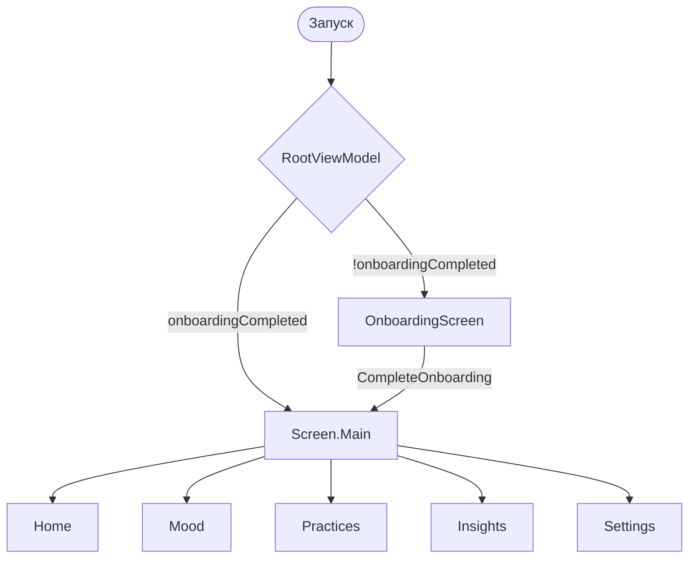

# Elyria Android — описание приложения

**Версия документа:** 1.6  
**Дата обновления:** 2026-06-03  
**Версия приложения:** 1.0.0 (versionCode 1)  
**Application ID:** `com.elyria.app`  
**Расположение:** корень репозитория — `Elyria.md`  
**Статус разработки:** шаги 0–5, 6.1–6.2, **6.L**, 7.1 завершены. В работе: 6.3 (crisis resources), 6.4 (reminders). Подробный отчёт: `Elyria_Current_State_Report.md`.

---

## Содержание

1. [Назначение и принципы](#1-назначение-и-принципы)
2. [Дизайн и UX](#2-дизайн-и-ux)
3. [Архитектура](#3-архитектура)
4. [Функциональность](#4-функциональность)
5. [Структура кода](#5-структура-кода)
6. [Описание слоёв и ключевых модулей](#6-описание-слоёв-и-ключевых-модулей)
7. [Навигация и потоки экранов](#7-навигация-и-потоки-экранов)
8. [Настройки, сборка и окружение](#8-настройки-сборка-и-окружение)
9. [Зависимости и технологический стек](#9-зависимости-и-технологический-стек)
10. [Тестирование и результаты сборки](#10-тестирование-и-результаты-сборки)
11. [Roadmap MVP](#11-roadmap-mvp)
12. [Безопасность и compliance](#12-безопасность-и-compliance)

---

## 1. Назначение и принципы

**Elyria** — мобильное Android-приложение для ментального благополучия: ежедневный лог настроения, короткие практики осознанности, локальные инсайты и on-device AI-компаньон (без отправки данных на сервер в MVP).

### Ключевые принципы

| Принцип | Реализация |
|--------|------------|
| **Privacy-first** | Нет `INTERNET` в манифесте; данные на устройстве |
| **Не замена терапии** | `DisclaimerBanner` на onboarding, home, settings |
| **Calming UI** | Много воздуха, мягкие формы, приглушённые тени |
| **Accessibility** | TalkBack labels на mood-кругах, touch targets ≥ 48 dp |
| **Clean Architecture** | domain ← data, presentation → domain |

Эталон **масштаба UI** (отступы, размеры шрифтов, touch targets) взят из production-приложения [Fluxly / moneymorpheus](file:///home/kali-user/Development/moneymorpheus) — горизонтальные поля 18–24 dp, заголовки 22–35 sp, минимальная зона нажатия 48 dp.

---

## 2. Дизайн и UX

### 2.1. Стиль интерфейса

- **Стиль:** минималистичный calming UI.
- **Воздух:** padding 16–24 dp (`presentation/ui/theme/Dimens.kt`).
- **Скругления:** 12–16 dp (`radiusSm` / `radiusMd` / `radiusLg`).
- **Тени:** `elevationSubtle = 2.dp` на карточках практик.
- **Анимации (план):** fade + slide, 200–300 ms (`core/constants/AnimationDurations.kt`).
- **Цель UX:** снижение тревоги — крупные цели касания, понятные эмодзи, без визуального шума.

### 2.2. Цветовая палитра

Определена в `presentation/ui/theme/ColorPalette.kt`, акценты настроения — `core/constants/MoodColors.kt`. Material3 `ColorScheme` в `presentation/ui/theme/Theme.kt`. Dynamic Material You **отключён**.

| Token | Light | Dark | Смысл |
|-------|-------|------|--------|
| Primary | `#5B8DEE` | `#4A6FA5` | Спокойный синий — доверие |
| Accent / Growth | `#7ED321` | `#7ED321` | Мягкий зелёный — рост |
| Background | `#F8FAFC` | `#0F172A` | Фон экрана |
| Surface | `#FFFFFF` | `#1E293B` | Карточки |
| Text Primary | `#1E293B` | `#F1F5F9` | Основной текст |
| Text Secondary | `#64748B` | `#94A3B8` | Вторичный текст |
| Mood Lavender | `#C4B5FD` | — | Акцент настроения (низкое) |
| Mood Beige | `#E8DCC8` | — | Позитивные состояния |

### 2.3. Типографика

`TypeScale` + `Typography.kt` (`mindEaseTypography()`), применяется в `Theme.kt`:

| Стиль | Размер | Использование |
|-------|--------|----------------|
| displayLarge | 35 sp | Заголовок onboarding («Elyria») |
| headlineMedium | 22 sp | Заголовки экранов |
| titleMedium | 19 sp | Подзаголовки, streak |
| bodyLarge | 17 sp | Основной текст |
| labelLarge | 15 sp | Метки, длительность практик |
| bodySmall | 13 sp | Disclaimer, подписи |

Шрифт: `FontFamily.SansSerif` (системный, без кастомного TTF в MVP).

### 2.4. Размеры и отступы (`Dimens`)

| Token | Значение | Источник / назначение |
|-------|----------|------------------------|
| screenHorizontal | 20 dp | Поля экрана (Fluxly ~20) |
| sheetPadding | 24 dp | Onboarding, модалки |
| cardPadding | 16 dp | Внутри карточек |
| spacingSm–Xl | 8–24 dp | Вертикальный ритм |
| radiusSm–Lg | 12–16 dp | Карточки, баннеры |
| minTouchTarget | 48 dp | Accessibility |
| moodCircleSize | 56 dp | Mood selector |
| elevationSubtle | 2 dp | Card elevation |

### 2.5. UI-компоненты (реализовано / план)

| Компонент | Файл | Статус |
|-----------|------|--------|
| Mood selector (LazyRow, эмодзи) | `MoodSelector.kt` | ✅ |
| Disclaimer banner | `DisclaimerBanner.kt` | ✅ |
| Bottom navigation (5 вкладок) | `ElyriaScaffold.kt` | ✅ |
| Practice cards | `PracticesScreen.kt` + `PracticesViewModel` | ✅ (каталог через `GetPracticesUseCase`) |
| Progress ring / streak badge | `HomeScreen` | ✅ streak badge |
| Lottie на карточках | `LottiePracticeCard`, `PracticeDetailScreen` | ✅ |
| Insights chart (Canvas) | `MoodTrendChart` + `InsightsScreen` | ✅ |
| Practice timer | `PracticeTimer`, `PracticeDetailViewModel` | ✅ |
| Crisis resources screen | — | 🔲 Шаг 6 |

### 2.6. Тема приложения

`AppThemeMode`: `SYSTEM` | `LIGHT` | `DARK` — DataStore → `ObserveAppSettingsUseCase` → `RootViewModel` → `ElyriaApp` → `ElyriaTheme(themeMode)`.

---

## 3. Архитектура

### 3.1. Паттерн

**Clean Architecture + MVVM + Repository + UseCase**

```
┌─────────────────────────────────────────────────────────┐
│  presentation (Compose UI, ViewModel, Navigation)      │
└───────────────────────────┬─────────────────────────────┘
                            │ UseCase / StateFlow
┌───────────────────────────▼─────────────────────────────┐
│  domain (models, repository interfaces, use cases)       │
└───────────────────────────┬─────────────────────────────┘
                            │ interfaces
┌───────────────────────────▼─────────────────────────────┐
│  data (Room, DataStore, AI, repository impl)             │
└─────────────────────────────────────────────────────────┘
         ▲
         │ Hilt (di/)
```

### 3.2. Правила кода

- **UiState:** общий `core/base/UiState.kt` + screen-specific `sealed interface` (`OnboardingUiState`, `MoodLogUiState`, …).
- **UiEvent:** `core/base/UiEvent.kt` для one-shot событий (snackbar, navigation).
- **ViewModel:** наследуют `BaseViewModel`; общаются **только с UseCase**, не с Room/DataStore напрямую.
- **Один UseCase — одна операция** (`CompleteOnboardingUseCase`, `ObserveAppSettingsUseCase`, …).
- **Ранние return**, функции ≤ ~30 строк (целевой лимит).
- **Комментарии:** только WHY и edge cases (на английском в коде).

### 3.3. Асинхронность

- Kotlin Coroutines + `viewModelScope`
- Потоки настроек: `StateFlow` / `Flow` из DataStore
- План: `SharedFlow` для одноразовых событий (snackbar, navigation)

### 3.4. DI (Hilt)

| Module | Назначение |
|--------|------------|
| `AppModule` | `DataStore<Preferences>`, `@IoDispatcher` |
| `RepositoryModule` | Binds: Settings, Mood, Journal, Practice repositories |
| `UseCaseModule` | Binds: `AICompanion` → `MockAICompanion` |
| `DatabaseModule` | ✅ `AppDatabase`, `MoodDao`, `JournalDao` |

**ViewModelModule не нужен:** ViewModels помечены `@HiltViewModel` и создаются Hilt автоматически.

### 3.5. Целевая пакетная структура (соответствие)

Рекомендованная структура Clean Architecture **реализована**; Room подключён через Hilt `DatabaseModule` (без ручного singleton в `AppDatabase`).

```
com.elyria.app
├── presentation/
│   ├── ui/
│   │   ├── components/     ✅ MoodSelector, DisclaimerBanner, ElyriaScaffold
│   │   ├── screens/        ✅ onboarding, home, mood, practices, insights, settings
│   │   ├── theme/          ✅ ColorPalette, Typography, Dimens, Theme
│   │   └── utils/          ✅ UiExtensions (modifiers)
│   ├── viewmodel/          ✅ + BaseViewModel
│   └── navigation/         ✅ Screen.kt (sealed), NavGraph.kt
├── domain/
│   ├── model/              ✅ MoodEntry, JournalEntry, StreakInfo, Insight, Practice, …
│   ├── usecase/            ✅ mood/, streak/, insights/, onboarding/, settings/, practice/
│   └── repository/         ✅ интерфейсы Mood, Journal, Practice, Settings
├── data/
│   ├── local/
│   │   ├── dao/            ✅ MoodDao, JournalDao (Room)
│   │   ├── entity/         ✅ MoodEntryEntity, JournalEntryEntity
│   │   ├── mapper/         ✅ Entity ↔ Domain
│   │   ├── converter/      ✅ LocalDateTimeConverter (@TypeConverter)
│   │   ├── database/       ✅ AppDatabase v1
│   │   ├── datastore/      ✅ UserPreferences
│   │   └── practice/       ✅ PracticeCatalog (internal)
│   ├── repository/         ✅ Mood/Journal → Room; Practice/Settings — как раньше
│   └── ai/                 ✅ AICompanion, MockAICompanion
├── di/                     ✅ App, Repository, UseCase, Database modules
├── core/
│   ├── base/               ✅ UiState, UiEvent, BaseViewModel
│   ├── constants/          ✅ AppConstants, AnimationDurations, MoodColors
│   ├── utils/              ✅ DateUtils
│   ├── extensions/         ✅ FlowExtensions
│   └── exception/          ✅ AppException
├── ElyriaApplication.kt
└── MainActivity.kt
```

| Рекомендация | Статус |
|--------------|--------|
| presentation → только domain | ✅ ViewModels → UseCase |
| domain не знает data/presentation | ✅ |
| theme в presentation/ui | ✅ перенесено из core/theme |
| Screen sealed + NavGraph | ✅ `Screen.kt`, `NavGraph.kt` |
| BaseViewModel + UiState | ✅ `core/base/` |
| ViewModelModule | ➖ заменён `@HiltViewModel` |

---

## 4. Функциональность

### 4.1. Реализовано (шаги 0–4)

| Функция | Описание |
|---------|----------|
| **Onboarding** | Экран приветствия, disclaimer, кнопка «Get started» → `CompleteOnboardingUseCase` → DataStore |
| **Главная** | Реактивный streak (`ObserveStreakUseCase`), приветствие с последним mood (`GetLatestMoodUseCase`) |
| **Mood log** | Сохранение в Room через `LogMoodUseCase`, Snackbar + возврат на Home |
| **Insights** | `GetInsightsUseCase` — неделя/месяц, средний mood, тренд, summary |
| **Practices** | `PracticesScreen` (Lottie cards) → `PracticeDetailScreen` + таймер Start/Pause/Reset |
| **Settings** | Заглушка + disclaimer |
| **Навигация** | `Screen` sealed interface + `NavGraph`, bottom bar |
| **Тема** | `ObserveAppSettingsUseCase` (переключатель UI — шаг 6) |
| **AI mock** | `MockAICompanion` через `UseCaseModule` (подключение в UI — шаг 5) |

### 4.2. Запланировано (MVP)

| Функция | Шаг |
|---------|-----|
| ~~Сохранение mood / journal в Room~~ | ✅ шаг 2 |
| ~~UseCases: LogMood, Insights, Streak~~ | ✅ шаг 3 |
| ~~Таймер практик, Lottie, полные экраны~~ | ✅ шаг 4 |
| On-device AI (mock → ML Kit) | 5 |
| WorkManager reminders, export JSON, delete all | 6 |
| Unit / Compose UI tests | 7 |
| Crisis keywords → resources | 6 |
| Streak recalculation worker | 6 |

### 4.3. Доменные модели

| Модель | Файл | Поля |
|--------|------|------|
| `MoodLevel` | `MoodLevel.kt` | enum VERY_LOW…GREAT (score 1–5) |
| `MoodEntry` | `MoodEntry.kt` | id, moodLevel, note?, loggedAt, sentimentScore? |
| `JournalEntry` | `JournalEntry.kt` | id, text, createdAt |
| `StreakInfo` | `StreakInfo.kt` | currentStreak, longestStreak, lastLogDate? |
| `Insight` | `Insight.kt` | summary, periodStart/End, averageMoodScore, trend, mostFrequentMood? |
| `InsightPeriod` | `InsightPeriod.kt` | WEEK, MONTH |
| `MoodTrend` | `MoodTrend.kt` | UP, DOWN, STABLE |
| `DateRange` | `DateRange.kt` | start/end LocalDate → millis для Room |
| `Practice` | `Practice.kt` | id, title, description, durationMinutes, lottieAsset |
| `AppSettings` | `AppSettings.kt` | themeMode, onboardingCompleted |
| `AppThemeMode` | `AppThemeMode.kt` | SYSTEM, LIGHT, DARK |

---

## 5. Структура кода

Документация: **`Elyria.md`** (корень репозитория). Код: **`android/`**.

```
Elyria/
├── Elyria.md                 ← этот файл
├── .gitignore
└── android/
    ├── app/src/main/kotlin/com/elyria/app/
    │   ├── ElyriaApplication.kt
    │   ├── MainActivity.kt
    │   ├── core/               # base, constants, utils, extensions, exception
    │   ├── di/                 # App, Repository, UseCase, Database
    │   ├── domain/             # model, repository, usecase/*
    │   ├── data/               # local/*, repository, ai
    │   └── presentation/       # navigation, viewmodel, ui/*
    ├── build.gradle.kts
    └── gradlew
```

**Статистика (2026-06-03, после рефакторинга):**

- Kotlin-файлов в `src/main`: **~80**
- Debug APK: **~24 MB** (`android/app/build/outputs/apk/debug/app-debug.apk`)

---

## 6. Описание слоёв и ключевых модулей

### 6.1. Точка входа

| Класс | Роль |
|-------|------|
| `ElyriaApplication` | `@HiltAndroidApp` |
| `MainActivity` | `enableEdgeToEdge()`, `setContent { ElyriaApp() }` |
| `ElyriaApp` | `RootViewModel` → loading / `ElyriaNavGraph` + `ElyriaTheme` |

### 6.2. Presentation — ViewModels

| ViewModel | Базовый класс | UseCase / состояние |
|-----------|---------------|---------------------|
| `RootViewModel` | `BaseViewModel` | `ObserveAppSettingsUseCase` → `RootUiState` |
| `OnboardingViewModel` | `BaseViewModel` | `CompleteOnboardingUseCase` → `OnboardingUiState` |
| `HomeViewModel` | `BaseViewModel` | `ObserveStreakUseCase` + `GetLatestMoodUseCase` → `HomeUiState` |
| `MoodLogViewModel` | `BaseViewModel` | `LogMoodUseCase`, `MoodLogUiState`, `SharedFlow<UiEvent>` |
| `InsightsViewModel` | `BaseViewModel` | `GetInsightsUseCase`, период WEEK/MONTH |
| `PracticesViewModel` | `BaseViewModel` | `GetPracticesUseCase` → `PracticesUiState` |

Все ViewModel наследуют `core/base/BaseViewModel.kt`.

### 6.3. Presentation — UI

| Экран | Composable | ViewModel |
|-------|------------|-----------|
| Onboarding | `OnboardingScreen` | `OnboardingViewModel` |
| Home | `HomeScreen` | `HomeViewModel` |
| Mood | `MoodLogScreen` | `MoodLogViewModel` |
| Practices | `PracticesScreen` | `PracticesViewModel` |
| Insights | `InsightsScreen` (chart + AI placeholder) | `InsightsViewModel` |
| Practice detail | `PracticeDetailScreen` | `PracticeDetailViewModel` |
| Settings | `SettingsScreen` | — |

**`MoodSelector`:** горизонтальный `LazyRow`, 5 кругов с эмодзи, `contentDescription` для TalkBack, `Role.Button`, флаг `selected`.

### 6.4. Domain — UseCases

| UseCase | Пакет | Ответственность |
|---------|-------|----------------|
| `LogMoodUseCase` | `usecase/mood` | `MoodEntry` → `MoodRepository.insert()`, MVP `sentimentScore`, `Result<MoodEntry>` |
| `ObserveMoodEntriesUseCase` | `usecase/mood` | `Flow<List<MoodEntry>>`, опционально `DateRange` |
| `GetLatestMoodUseCase` | `usecase/mood` | `Flow<MoodEntry?>` для Home |
| `CalculateStreakUseCase` | `usecase/mood` | `StreakInfo` через `usecase/streak/StreakCalculator` |
| `ObserveStreakUseCase` | `usecase/mood` | реактивный `Flow<StreakInfo>` при изменении mood |
| `GetInsightsUseCase` | `usecase/insights` | `InsightPeriod` → `Insight` (avg, trend, summary) |
| `CompleteOnboardingUseCase` | `usecase/onboarding` | DataStore onboarding flag |
| `ObserveAppSettingsUseCase` | `usecase/settings` | `Flow<AppSettings>` |
| `GetPracticesUseCase` | `usecase/practice` | статический каталог практик |

**Streak (`usecase/streak/StreakCalculator`):** `calculate(List<LocalDate>, today = DateUtils.today())` — явный `ZoneId.systemDefault()` через `DateUtils`; дедуп по дням, игнор будущих дат.

**DST (переход на летнее/зимнее время):** `loggedAt` хранится как UTC millis; `DateUtils.timestampToLocalDate()` берёт offset **на момент записи** (java.time), поэтому чтение после перехода не сдвигает дату. Стрик считается по `LocalDate` — дубли в 02:00–03:00 в день fall back схлопываются в один день. Тесты: `DateUtilsDstTest` (`Europe/Prague`). Опционально «день с 04:00» — шаг 6.

| Артефакт | Статус |
|----------|--------|
| `SettingsRepository`, `PracticeRepository`, `MoodRepository`, `JournalRepository` | ✅ |
| `GenerateCompanionResponseUseCase` | 🔲 шаг 5 |

### 6.6. Streak и инсайты (presentation)

| Экран | Поведение |
|-------|-----------|
| **Home** | Badge `N day streak`, best longest, последний mood в selector |
| **Mood log** | Save → Room → Snackbar → `NavigateBack` → Home |
| **Insights** | FilterChip Week/Month, карточка summary + avg + trend |

### 6.5. Data

| Компонент | Статус |
|-----------|--------|
| `UserPreferences` (DataStore) | ✅ keys: `theme_mode`, `onboarding_completed`, `app_language` |
| `SettingsRepositoryImpl` | ✅ |
| **Room** | ✅ `elyria.db`, таблицы `mood_entries`, `journal_entries` |
| `MoodRepositoryImpl` / `JournalRepositoryImpl` | ✅ Room + mappers + `Dispatchers.IO` |
| `StreakInfo` | вычисляется из mood-логов (шаг 3), отдельной таблицы нет |
| **DataStore** | настройки (`theme`, `onboarding`) — без миграции в Room |
| `MockAICompanion` | ✅ rule-based ответы (без UI) |

**Room schema (v2):**

| Таблица | Поля |
|---------|------|
| `mood_entries` | id, mood_level, note, logged_at (ms), sentiment_score, **emotions_json**, **triggers_json** |
| `journal_entries` | id, text, created_at (ms) |

Миграция `MIGRATION_1_2` (1→2); **без** `fallbackToDestructiveMigration`.

**DAO:** `observeAll`, `observeByDateRange`, `observeLatest` (`Flow`), `insert`, `deleteAll` (возвращает `Int`).

**Repository (domain):** те же операции + маппинг Entity ↔ `MoodEntry` / `JournalEntry`; `insert` / `deleteAll` — `withContext(Dispatchers.IO)`.

**DataStore keys:**

| Key | Тип | Значения |
|-----|-----|----------|
| `theme_mode` | String | `system`, `light`, `dark` |
| `onboarding_completed` | Boolean | default `false` |
| `app_language` | String | `system`, `en`, `ru`, `uk`, `ro` → `AppLanguage` |

Имя файла: `elyria_preferences` (`AppConstants.DATASTORE_NAME`).

### 6.5.1. Локализация UI (шаг 6.L)

| Компонент | Описание |
|-----------|----------|
| `AppLanguage` | domain enum: System / EN / RU / UK / RO |
| `CompanionLanguage` | отдельно: ML Kit по тексту сообщения companion |
| `LocalizedContext.kt` | `Context.withAppLanguage()` для Compose |
| `ElyriaApp` | `CompositionLocalProvider(LocalContext)` + `key(appLanguage)` |
| Resources | `values`, `values-ru`, `values-uk`, `values-ro` (129 ключей, `StringResourceKeysTest`) |
| `UiText` | ViewModel-сообщения без `Context` |

### 6.6. Navigation (typed routes)

`presentation/navigation/Screen.kt` — **sealed interface** с `@Serializable` destinations:

- `Screen.Onboarding`, `Screen.Main`
- `Screen.Home`, `Screen.Mood`, `Screen.Practices`, `Screen.Insights`, `Screen.Settings`

`NavGraph.kt` (`ElyriaNavGraph`): внешний NavHost (onboarding → main), внутри — tab NavHost + `ElyriaScaffold` + `popUpTo(Screen.Home) { saveState = true }`.

---

## 7. Навигация и потоки экранов



**Первый запуск:** `onboarding_completed = false` → `Screen.Onboarding`.  
**Повторный запуск:** DataStore `true` → `Screen.Main` → `Screen.Home`.

---

## 8. Настройки, сборка и окружение

### 8.1. Требования

| Параметр | Значение |
|----------|----------|
| minSdk | 24 |
| targetSdk / compileSdk | 35 |
| JVM (compile) | 17 |
| Gradle JDK | **21** (обязательно; JDK 25 не поддерживается AGP) |
| Gradle | 8.14 |

### 8.2. `local.properties` (не коммитить)

Создать в `android/local.properties`:

```properties
sdk.dir=/path/to/Android/sdk
# Опционально для будущего backend-proxy (MVP пустой):
# LLM_API_KEY=
```

`LLM_API_KEY` пробрасывается в `BuildConfig` (MVP всегда пустая строка).

### 8.3. `gradle.properties`

```properties
org.gradle.jvmargs=-Xmx2048m -Dfile.encoding=UTF-8
org.gradle.java.home=/usr/lib/jvm/java-21-openjdk-amd64
android.useAndroidX=true
```

На другой машине измените `org.gradle.java.home` или удалите строку и задайте `JAVA_HOME` на JDK 17/21.

### 8.4. Команды сборки

```bash
cd android
./gradlew assembleDebug    # APK debug
./gradlew assembleRelease  # release (minify off)
./gradlew test             # unit tests (см. §10)
```

### 8.5. `.gitignore`

- Корень репо: `android/local.properties`, `android/**/build/`
- `android/.gitignore`: `local.properties`, `secrets.properties`, `*.env`, `build/`

### 8.6. AndroidManifest (важное)

- `android:allowBackup="false"` — снижение утечки бэкапов
- **Нет** `INTERNET` permission — privacy-first MVP
- `windowSoftInputMode="adjustResize"` — клавиатура на Mood log

---

## 9. Зависимости и технологический стек

| Категория | Версия / артефакт |
|-----------|------------------|
| Kotlin | 2.2.20 |
| AGP | 8.11.1 |
| Compose BOM | 2025.02.00 |
| Material3 | via BOM |
| Navigation Compose | 2.8.9 |
| Hilt | 2.57.2 |
| Room | 2.7.1 (KSP; совместимость с Kotlin 2.2) |
| Desugaring | `desugar_jdk_libs` (java.time на minSdk 24) |
| DataStore Preferences | 1.1.2 |
| WorkManager | 2.10.0 |
| Lottie Compose | 6.6.2 |
| ML Kit Language ID | 17.0.6 (заготовка) |
| Serialization | kotlinx-json 1.8.0 |
| Test | JUnit 4.13.2, MockK, Turbine, Compose UI Test |

---

## 10. Тестирование и результаты сборки

### 10.1. Последний прогон (2026-06-03, шаг 6.L)

Окружение: Linux, JDK 21 через `gradle.properties`, Android SDK `ANDROID_HOME`.

| Задача | Команда | Результат |
|--------|---------|-----------|
| Unit tests | `./gradlew test` | **BUILD SUCCESSFUL** |
| Debug APK | `./gradlew assembleDebug` | **BUILD SUCCESSFUL** |
| Комбинированно | `./gradlew test assembleDebug` | **BUILD SUCCESSFUL** |

### 10.2. Unit / instrumented tests

| Тип | Статус | Примечание |
|-----|--------|------------|
| `MoodEntryMapperTest` | ✅ 3 | round-trip, mood level |
| `JournalEntryMapperTest` | ✅ 2 | round-trip, timestamp |
| `LogMoodUseCaseTest` | ✅ 3 | insert, ошибка БД, trim note |
| `StreakCalculatorTest` | ✅ 8 | edge cases streak |
| `DateUtilsDstTest` | ✅ 4 | fall back / spring forward (Prague) |
| `GetInsightsUseCaseTest` | ✅ 3 | empty, entries, stable trend |
| `AppLanguageTest` | ✅ 7 | fromCode mapping |
| `SetAppLanguageUseCaseTest` | ✅ 2 | success / failure |
| `StringResourceKeysTest` | ✅ 1 | parity EN/RU/UK/RO |
| `MockAICompanionLanguageTest` | ✅ | multilingual companion |
| `GenerateCompanionChatResponseUseCaseTest` | ✅ 8 | chat + language |
| `GetMoodPatternSummaryUseCaseTest` | ✅ 4 | patterns |
| `BuildExportDataUseCaseTest` | ✅ 6 | export payload |
| `DeleteAllUserDataUseCaseTest` | ✅ | delete scope |
| `SetThemeModeUseCaseTest` | ✅ 2 | theme |
| `src/androidTest` (Compose UI) | **Нет** | backlog |

**Итог:** `./gradlew test` — **77 unit-тестов** (debug), BUILD SUCCESSFUL.

### 10.3. Рекомендуемые тесты (шаг 7)

| Класс | Тип | Что проверять |
|-------|-----|----------------|
| `CompleteOnboardingUseCase` | Unit + MockK | вызов `setOnboardingCompleted(true)` |
| `MoodSelector` | Compose UI | выбор mood, semantics selected |
| `MoodLogViewModel` | Unit | Saving → Success, UiEvent |

### 10.4. Известные ограничения сборки

- **JDK 25:** Gradle падает с сообщением `25.0.3` — использовать JDK 21 или 17.
- **Release signing:** пока debug keys (`signingConfig` не настроен для release).
- **ProGuard:** `isMinifyEnabled = false` в release.

---

## 11. Roadmap MVP

| Неделя | Шаг | Содержание | Статус |
|--------|-----|------------|--------|
| 1 | 0 | Gradle, Hilt, зависимости | ✅ |
| 1 | 1 | Структура CA, theme, nav, DataStore | ✅ |
| 1–2 | 2 | Room + repositories | ✅ |
| 2 | 3 | UseCases + сохранение mood + streak + insights | ✅ |
| 2–3 | 4 | UI practices, timer, Lottie | ✅ |
| 3–4 | 5 | AI reflection, companion, ML Kit language | ✅ |
| 4–5 | 6.1–6.2 | Settings, theme, export, delete | ✅ |
| 4–5 | 6.L | App language selector, full UI i18n | ✅ |
| 4–5 | 7.1 | Emotions, triggers, patterns, Inner Garden | ✅ |
| 5 | 6.3 | Crisis resources screen | 🔲 |
| 5 | 6.4 | WorkManager reminders | 🔲 |
| 6 | 8+ | PDF, Health Connect (optional) | 🔲 |

**Критерии готовности MVP:** onboarding + daily mood + 4–5 practices + insights + streak + local-only + reminders + export/delete + a11y + disclaimer.

---

## 12. Безопасность и compliance

| Требование | Статус MVP |
|------------|------------|
| Данные только on-device | ✅ нет сетевых permission |
| Disclaimer | ✅ строка `disclaimer_short` |
| GDPR / CCPA delete & export | ✅ Settings export JSON + delete all |
| Crisis keywords → help resources | 🔲 шаг 6.3 (placeholder в Settings) |
| Секреты не в git | ✅ `.gitignore` |
| Keystore для будущего API | 🔲 backend-proxy only |

---

## Связанные документы

- `Elyria_Current_State_Report.md` — актуальный отчёт для продолжения разработки.
- План разработки (чат / шаги 0–8) — исходное ТЗ проекта.
- Эталон UI-масштаба: `/home/kali-user/Development/moneymorpheus/lib/core/constants.dart`, `Dimens.kt`.

---

*Обновлять при завершении шагов 2–7 и появлении unit/UI тестов.*
